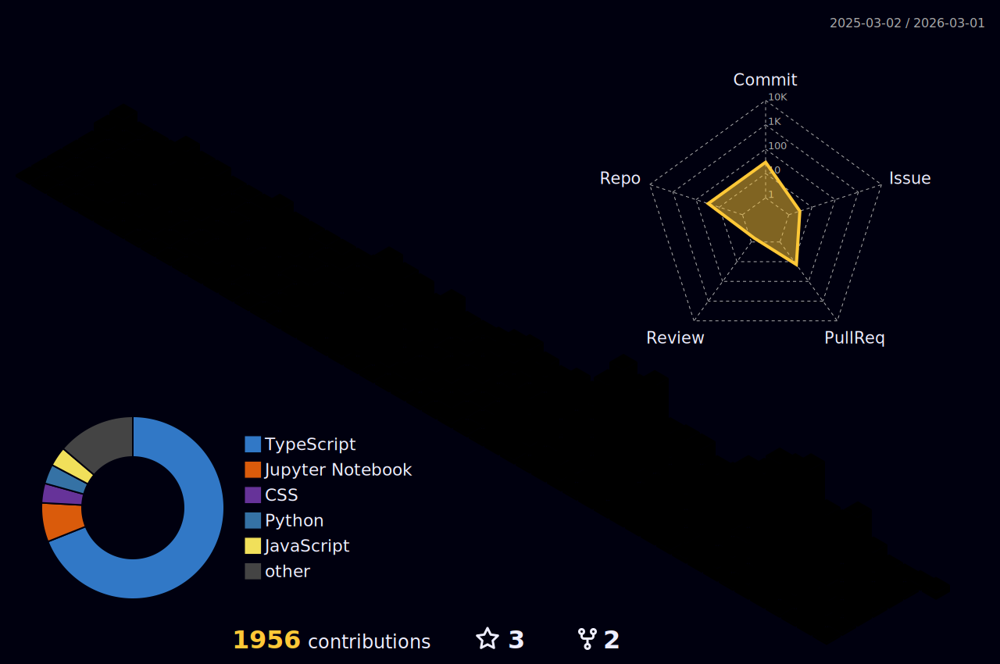

<h1 align="center">Hi there, I'm Nawapat </h1>
<h3 align="center">Full-Stack Developer @ Covest Finance 🇹🇭</h3>

  
  &nbsp;
  
  &nbsp;
  
  &nbsp;
  
  &nbsp;
  
  &nbsp;
  

---

### 👨‍💻 About Me

<table>
<tr>
<td width="65%" valign="top">

- 🔭 I'm currently working at **Covest Finance**
- 💻 Full-stack developer building across the entire stack — frontend, backend, and infrastructure
- 🌱 Always learning new tools and cloud platforms
- ⚡ My motto: perseverance and continuous learning — never stop building
- 📫 Reach me on [LinkedIn](https://www.linkedin.com/in/beamnawapat)

</td>
<td width="35%" valign="top" align="center">

  

</td>
</tr>
</table>

---

### 🛠️ Tech Stack

**Languages**

  
  
  
  
  
  
  

**Frontend**

  
  
  
  
  
  
  
  

**Backend**

  
  
  
  
  
  
  
  

**Databases**

  
  
  
  

**DevOps & Cloud**

  
  
  
  
  
  
  
  
  
  
  

**Tools & Services**

  
  
  
  

---

### 📊 Stats & Activity

#### 🏙️ Contribution City

  

#### 📈 GitHub Stats

  

  
  

  
  

  

#### 🤖 AI Usage

  

#### 🌾 GitAnimals Farm

  

